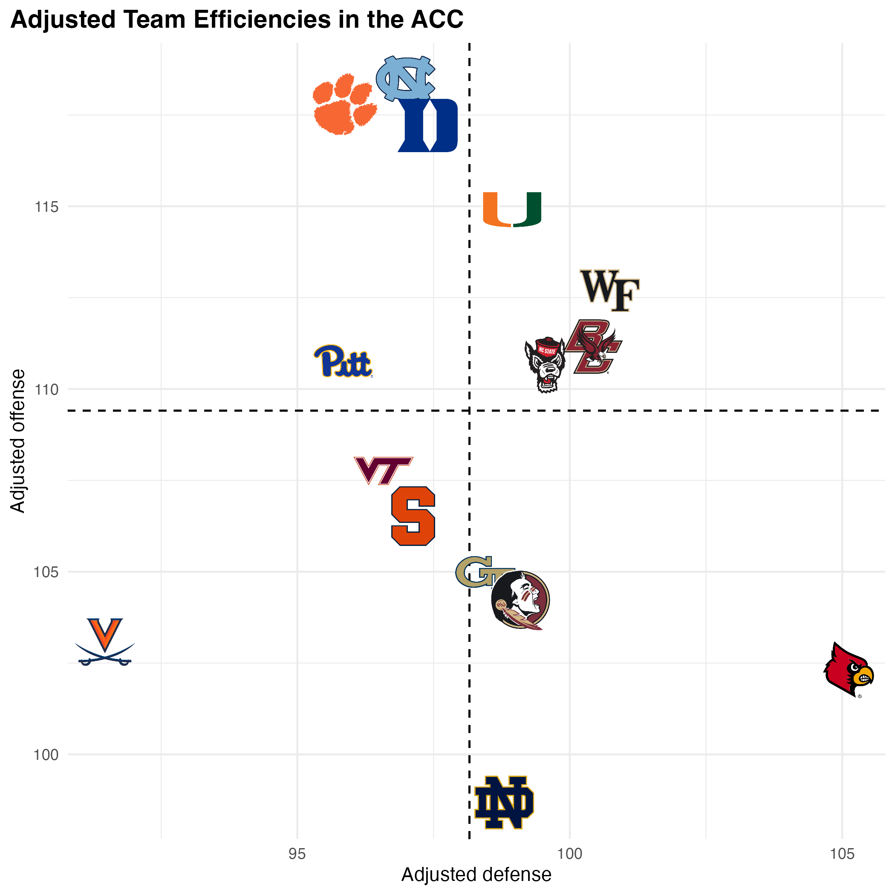
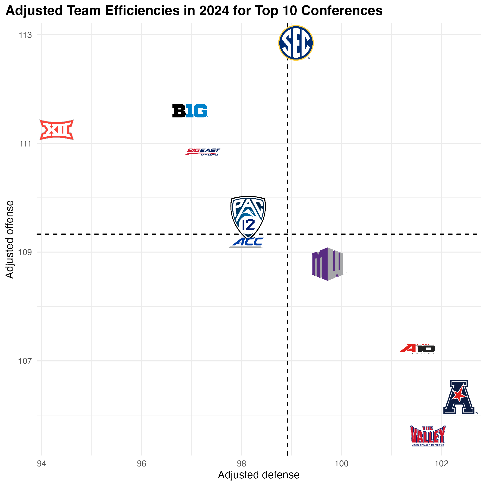
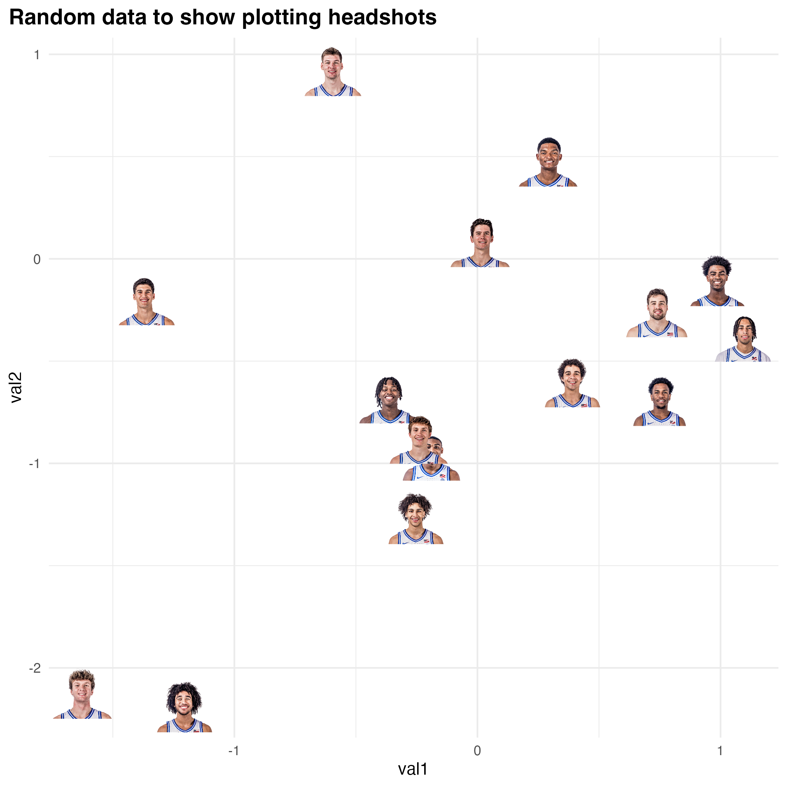
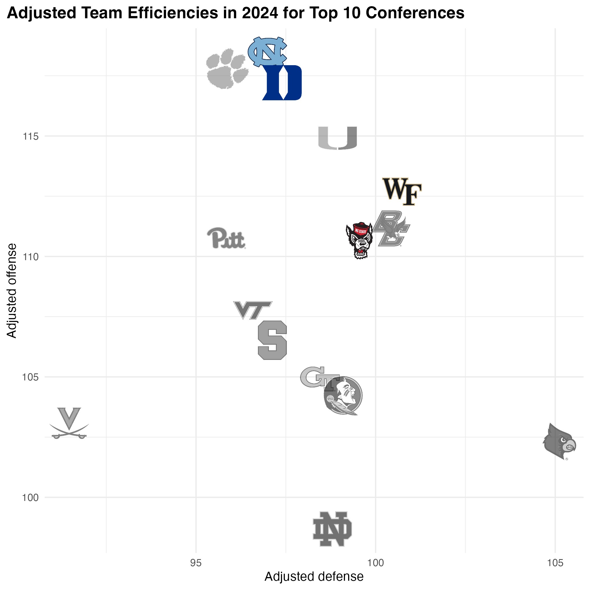
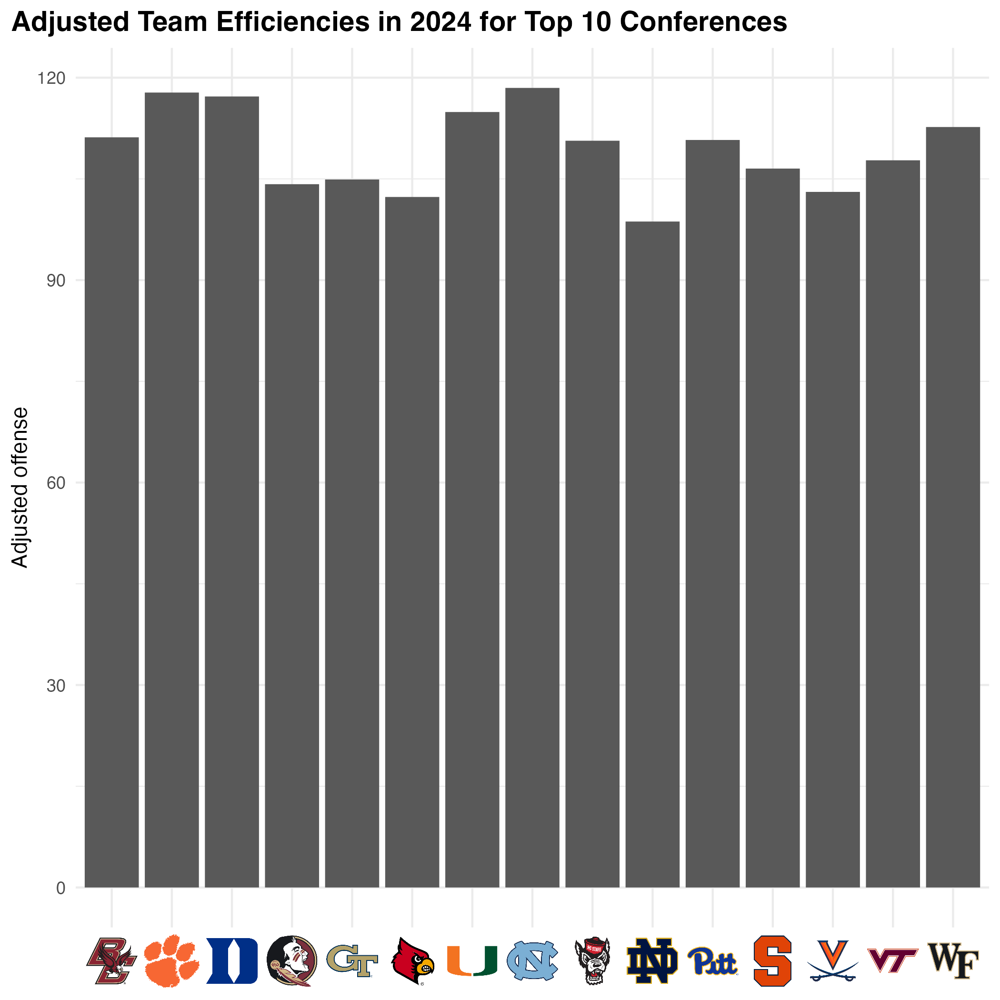
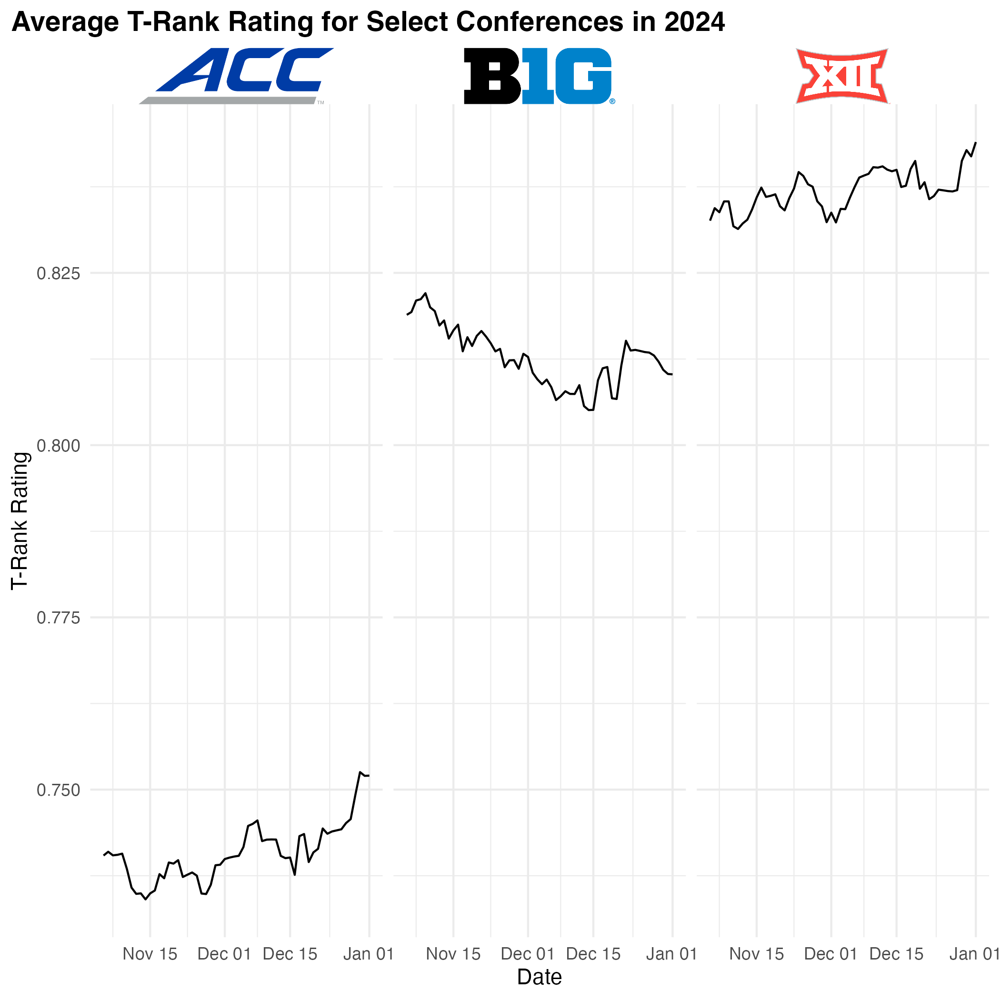
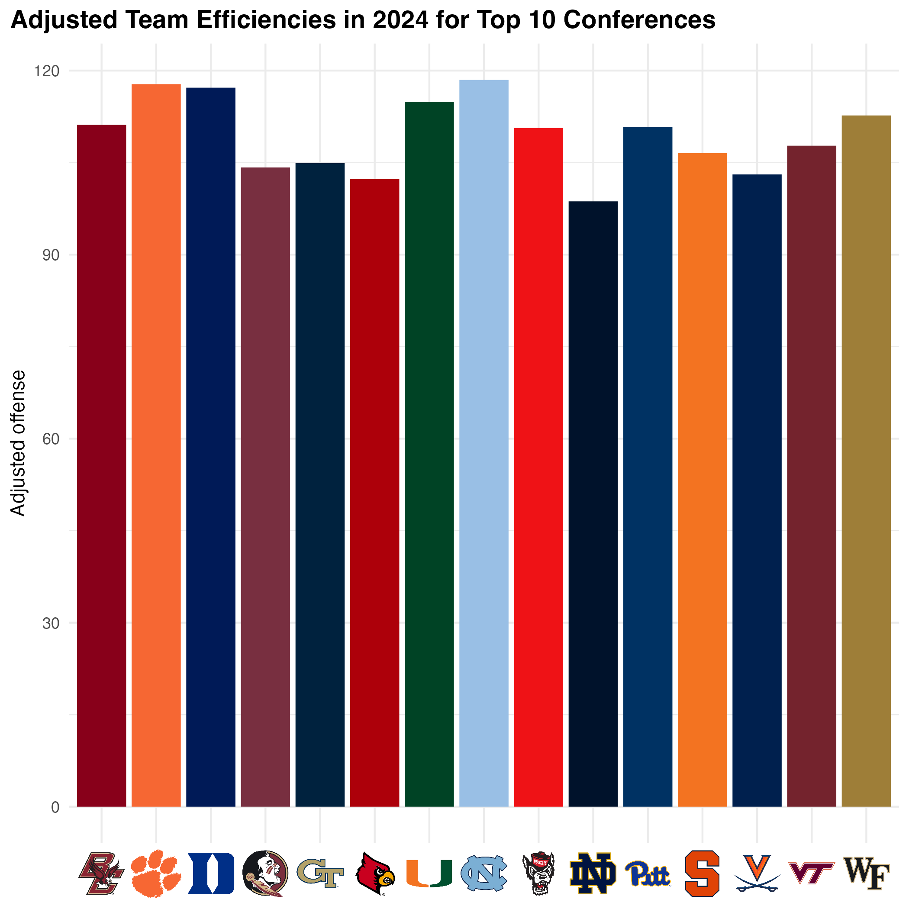
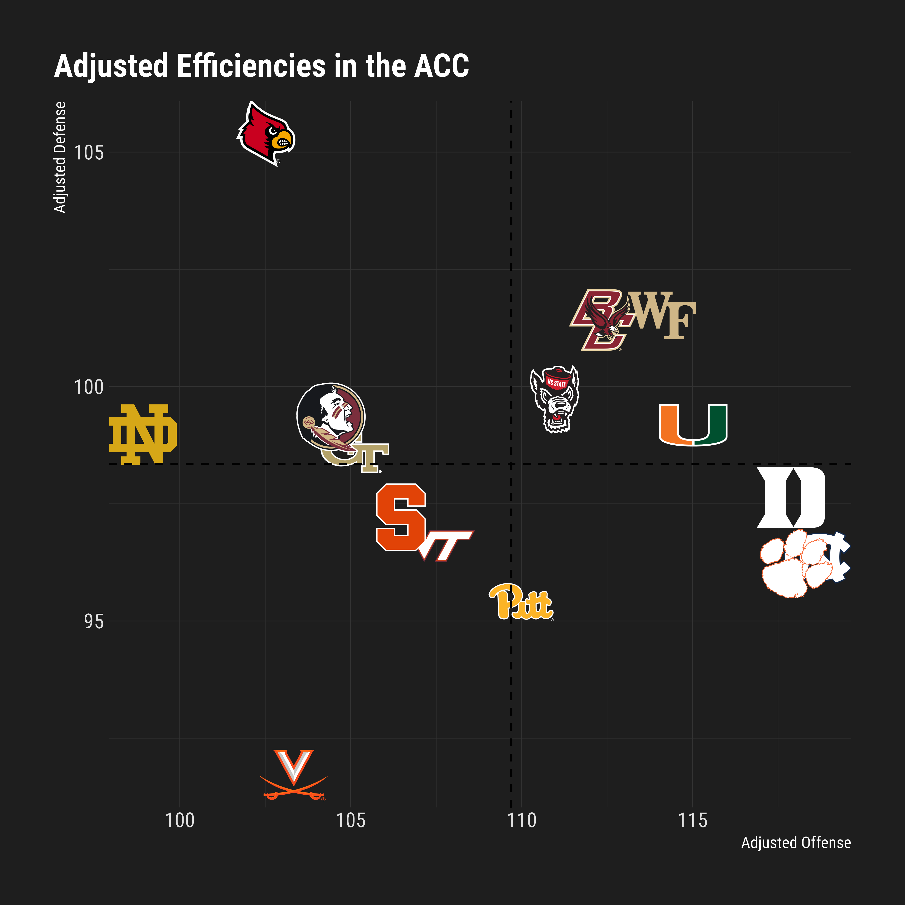
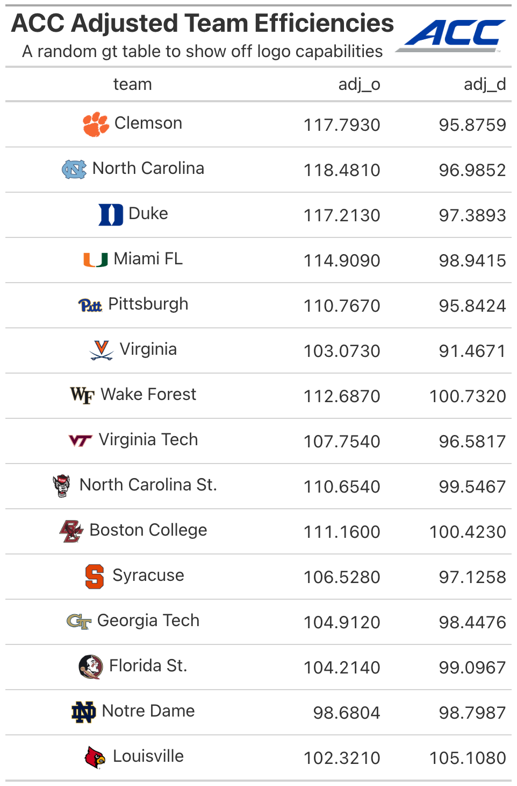

<!-- README.md is generated from README.Rmd. Please edit that file -->

```{r, include = FALSE}
knitr::opts_chunk$set(
  collapse = TRUE,
  eval = FALSE,
  comment = "#>",
  fig.path = "man/figures/README-",
  out.width = "100%"
)
```

# cbbplotR: Your Gateway to CBB Visualization in R

Welcome to **`cbbplotR`**, an R package designed to bring the vibrant world of college basketball into your data visualizations. This package, an extension of **`nflplotR`**, is your go-to toolkit for incorporating college basketball team and conference logos, player headshots, and team colors into **`ggplot2`** plots. Tailored to work seamlessly with **`cbbdata`**, **`cbbplotR`** requires team and conference names that match those found in the [`cbbdata` package.](https://cbbdata.aweatherman.com) There is a limited internal name conversion function for teams and conferences that will match some common sites, but it is recommend to use `cbbdata` names. If you want to request adding specific name conversions, [please open an issue on the package's GitHub.](https://github.com/andreweatherman/cbbplotR)

`cbbplotR` is an extension of the popular `{sport}plotR` family of packages, including `nflplotR`, `nbaplotR`, `mlbplotR`, and `cfbplotR`. This package was heavily adapted from `nflplotR` and `ggpath` from developer Sebastian Carl.

## Installation

To get started with **`cbbplotR`**, you can install it using the **`pak`** package.

```{r, eval=FALSE}
if (!require("pak")) install.packages("pak")
pak::pak("andreweatherman/cbbplotR")
```

## Features

### Team logo plots

Visualize your data with style using **`cbbplotR`**'s team logo plots. These plots are not only visually appealing for social media but also intuitive and simple to create. The **`geom_cbb_teams`** function integrates team logos into your **`ggplot2`** scatter plots, requiring a **`team`** aesthetic aligned with **`cbbdata`**.

```{r}
cbbdata::cbd_torvik_ratings(year = 2024, conf = 'ACC') %>%
  ggplot(aes(adj_d, adj_o, team = team)) +
  geom_mean_lines(aes(x0 = adj_d, y0 = adj_o), color = 'black') +
  geom_cbb_teams(width = 0.08) +
  theme_minimal() +
  theme(
    plot.title = element_text(face = 'bold', size = 14),
    plot.title.position = 'plot'
  ) +
  labs(title = 'Adjusted Team Efficiencies in the ACC',
       x = 'Adjusted defense',
       y = 'Adjusted offense')
```

```{r, eval=TRUE, echo=FALSE}

```

Our plot also makes use of the `geom_mean_lines` function to draw reference lines that refer to the average values of each variable. (`geom_median_lines` is also available!) Both of these functions are pulled directly from the `ggpath` package.

### Conference logo plots

In addition to plotting team logos, `cbbplotR` also allows for plotting conference logos. The functionality is analogous to that of `geom_cbb_teams` and requires a valid conference name to be passed through the `conference` aesthetic.

```{r}
cbbdata::cbd_torvik_conf_factors(year = 2024) %>%
  slice(1:10) %>% 
  ggplot(aes(adj_d, adj_o, conference = conf)) +
  geom_mean_lines(aes(x0 = adj_d, y0 = adj_o), color = 'black') +
  geom_cbb_conferences(width = 0.08) +
  theme_minimal() +
  theme(
    plot.title = element_text(face = 'bold', size = 14),
    plot.title.position = 'plot'
  ) +
  labs(title = 'Adjusted Team Efficiencies in 2024 for Top 10 Conferences',
       x = 'Adjusted defense',
       y = 'Adjusted offense')
```

```{r, eval=TRUE, echo=FALSE}

```

### **Player Headshot Plots**

With **`cbbplotR`**, you can also incorporate player headshots into your visualizations. Note: You'll need to provide ESPN player IDs, which **`cbbplotR`** and `cbbdata` doesn't automatically retrieve.

You can grab ESPN player IDs manually, or you can use this snippet to grab all player IDs for a given team:

```{r}
# replace `150` with a teams' ESPN ID
jsonlite::fromJSON(glue::glue('http://site.api.espn.com/apis/site/v2/sports/basketball/mens-college-basketball/teams/{ESPN_TEAM_ID}/roster')) %>% 
  pluck('athletes') %>% 
  as_tibble() %>% 
  select(id, displayName)
```

To plot player headshots, simply include a column of ESPN player IDs in your data and pass that column as a `player_id` aesthetic to `geom_cbb_headshot`.

```{r}
set.seed(10)

ids <- jsonlite::fromJSON('http://site.api.espn.com/apis/site/v2/sports/basketball/mens-college-basketball/teams/150/roster') %>% 
  purrr::pluck('athletes') %>% 
  dplyr::as_tibble() %>% 
  dplyr::select(id, displayName)

random_data <- tibble(
  val1 = rnorm(nrow(ids)),
  val2 = rnorm(nrow(ids)),
  id = ids$id
)

random_data %>% 
  ggplot(aes(val1, val2)) +
  geom_cbb_headshots(aes(player_id = id, width = 0.1)) +
  theme_minimal() +
  theme(
    plot.title = element_text(face = 'bold', size = 14),
    plot.title.position = 'plot'
  ) +
  labs(title = 'Random data to show plotting headshots')
```

```{r, eval=TRUE, echo=FALSE}

```

## **Highlighting Features in cbbplotR**

There are *a lot* of Division 1 basketball teams, and drawing effective plots with hundreds of logos is challenging. One of the standout features of **`cbbplotR`** is its ability to highlight specific elements in your plots. This is particularly useful when dealing with a large number of logos or data points, but you want to draw attention to only a few key items. You can apply highlighting to teams, conferences, and players.

Highlighting in **`cbbplotR`** is designed to be both intuitive and flexible. You have several methods at your disposal:

1.  **Transparency Adjustment**: By setting a low alpha level for all elements except the ones you wish to highlight, you can subtly bring forward the focus points while keeping the context in the background.

2.  **Grayscale Application**: Another method involves converting all non-essential logos to grayscale, making the colored logos of your highlighted teams or conferences stand out vividly.

#### Implementation

Implementing these methods is straightforward. You can adjust your data manually, providing `alpha` and/or `color` values to certain teams, and pass those values to an `aes` layer – or you could let `cbbplotR` do the heavy lifting. Without needing to touch your own data, you can pass a vector of teams, conferences, or player IDs through the `highlight_X` argument of `geom_cbb_X` functions and specify a highlight type – `alpha`, `color`, or `both`.

For example, let's assume that we want to highlight the four Tobacco Road teams but still show their position relative to the rest of the ACC.

```{r}
cbbdata::cbd_torvik_ratings(year = 2024, conf = 'ACC') %>%
  ggplot(aes(adj_d, adj_o, team = team)) +
  geom_cbb_teams(highlight_teams = c('Duke', 'North Carolina', 'Wake Forest', 'North Carolina St.'),
                 width = 0.08, highlight_method = 'both') +
  theme_minimal() +
  theme(
    plot.title = element_text(face = 'bold', size = 14),
    plot.title.position = 'plot'
  ) +
  labs(title = 'Adjusted Team Efficiencies in 2024 for Top 10 Conferences',
       x = 'Adjusted defense',
       y = 'Adjusted offense')
```

```{r, eval=TRUE, echo=FALSE}

```

In this example, we chose to highlight our teams by increasing the transparency *and* changing logos to grayscale for our non-selected teams. You can choose to do both, `highlight_method = "both"`, or just one, `highlight_method = "alpha"` // `highlight_method = "color"`.

The process is analogous for the other `geom` methods – but the argument names switch relative to the function (`highlight_conferences` and `highlight_players`).

## Plotting **in element\_ Areas**

**`cbbplotR`** extends the standard capabilities of **`ggplot2`** by allowing you to place logos and headshots in various parts of your plot, such as in axes labels or inline with plot titles.

### **Logos in Axes**

With **`element_cbb_teams`**, `element_cbb_conferences`, and `element_cbb_headshots`, you can replace traditional axis text with logos and headshots. This is particularly effective for plots where team identity is more recognizable or impactful than just names.

```{r}
cbbdata::cbd_torvik_ratings(year = 2024, conf = 'ACC') %>%
  ggplot(aes(team, adj_o)) +
  geom_col() +
  theme_minimal() +
  theme(
    plot.title = element_text(face = 'bold', size = 14),
    plot.title.position = 'plot',
    axis.text.x = element_cbb_teams(size = 1)
  ) +
  labs(title = 'Adjusted Team Efficiencies in 2024 for Top 10 Conferences',
       y = 'Adjusted offense',
       x = NULL)
```

```{r, eval=TRUE, echo=FALSE}

```

This process is analogous for the other two `element_cbb_X` functions. You must correctly call the `element_X` function after the appropriate `theme` call -\> i.e. `axis.text.x` and not the broader `axis.text`.

### Logos in Facets

You can also place logos in facet titles with the `element_cbb_X` family of functions.

```{r}
cbbdata::cbd_torvik_ratings_archive(year = 2024) %>% 
  summarize(avg_rating = mean(barthag), .by = c(conf, date)) %>% 
  filter(conf %in% c('ACC', 'B10', 'B12')) %>% 
  ggplot(aes(date, avg_rating)) +
  geom_line() +
  facet_wrap(~conf) +
  theme_minimal() +
  theme(
    plot.title = element_text(face = 'bold', size = 14),
    plot.title.position = 'plot',
    strip.text.x = element_cbb_conferences(size = 1)
  ) +
  labs(title = 'Average T-Rank Rating for Select Conferences in 2024',
       x = 'Date',
       y = 'T-Rank Rating')
```

```{r, eval=TRUE, echo=FALSE}

```

## **Utilizing Colors and Fills in cbbplotR**

**`cbbplotR`** provides powerful functionalities for incorporating team and conference colors into your **`ggplot2`** visualizations. By using the **`scale_color/fill_cbb_X`** functions, you can easily map the aesthetic properties of your plots to the official colors of college basketball teams and conferences.

To make these functions work, simply assign `color` and/or `fill` properties in `aes` to your team or conference columns, and then add the appropriate scale function.

### **Using Scale Functions**

The `scale_color_cbb_teams` and `scale_fill_cbb_teams` functions allow you to assign team-specific colors to various plot elements. The `scale_color_cbb_conferences` and `scale_fill_cbb_conferences` functions work in the same manner and allow you to assign conference-specific color values.

```{r}
cbbdata::cbd_torvik_ratings(year = 2024, conf = 'ACC') %>%
  ggplot(aes(team, adj_o, fill = team)) +
  geom_col() +
  scale_fill_cbb_teams() +
  theme_minimal() +
  theme(
    plot.title = element_text(face = 'bold', size = 14),
    plot.title.position = 'plot',
    axis.text.x = element_cbb_teams(size = 1)
  ) +
  labs(title = 'Adjusted Team Efficiencies in 2024 for Top 10 Conferences',
       y = 'Adjusted offense',
       x = NULL)
```

```{r, eval=TRUE, echo=FALSE}

```

## **Enhancing Titles with Logos in cbbplotR**

**`cbbplotR`** ships with **`ggplot_cbb_logo_title`** and **`gt_cbb_logo_title`** functions to allow you to seamlessly incorporate team or conference logos into titles.

### **Adding Logos to ggplot2 Titles**

The **`ggplot_cbb_logo_title`** function is designed to integrate logos directly into the titles of **`ggplot2`** plots. This works by passing the logo as a `plot.tag` and setting the appropriate coordinates and position for it. You can adjust the position of the logo with the `hjust` and `vjust` arguments.

The function works for plotting team logos, conference logos, or player headshots. You must specify a type as one of `type = c('team', 'conference', 'headshot')`.

```{r}
cbbdata::cbd_torvik_ratings_archive(year = 2024, team = 'Duke') %>% 
  ggplot(aes(date, rank, color = team)) +
  geom_line(linewidth = 1.2) +
  scale_color_cbb_teams() +
  theme_minimal() +
  ggplot_cbb_logo_title('Duke', type = 'team', size = 1.8) +
  theme(
    plot.title = element_text(face = 'bold', size = 14),
    plot.title.position = 'plot',
  ) +
  labs(title = '2024 Duke T-Rank',
       subtitle = "This is to show how to include a logo in-line with a title plot",
       x = 'Date',
       y = 'T-Rank')
```

```{r, eval=TRUE, echo=FALSE}

```

### **Adding Logos in gt Table Titles**

Similarly, **`gt_cbb_logo_title`** is a function tailored for use with **`gt`** tables to integrate logos directly into a table header. This function works by returning HTML code that is then wrapped in an `HTML` tag and passed to the `tab_header(title)` function. Like with `ggplot_cbb_logo_title`, you can specify whether you want to plot a team logo, conference logo, or player headshot in the `type` argument.

You can adjust the logo size with `logo_height`, and you can also adjust various things about the title itself, including `X_font_size`, `X_font_weight`, and `X_lineheight` for both `title` and `subtitle`. If you use a `gt` table theme, or change the font later in the table, those changes *will* propogate in the title too. If you want to plot a custom image, perhaps a retro logo, you can specify a link to the image with `logo_link` (this will override any `value` or `type`).

```{r}
title <- gt_cbb_logo_title(
  title = 'ACC Adjusted Team Efficiencies',
  subtitle = 'A random gt table to show off logo capabilities',
  value = 'ACC',
  type = 'conference',
  logo_height = 30
)

cbbdata::cbd_torvik_ratings(year = 2024, conf = 'ACC') %>% 
  select(team, adj_o, adj_d) %>% 
  cbbdata::cbd_gt_logos(team, team) %>% 
  gt() %>% 
  fmt_markdown(team) %>% 
  tab_header(title = html(title))
```

```{r, eval=TRUE, echo=FALSE}

```

## My Plots pane in RStudio is slow!

If you are plotting numerous team logos, you might notice that RStudio can be slow to return the plot itself – which can possibly lead to your R session aborting. To fix this, `cbbplotR` borrows a function from the `ggpath` package called `ggpreview` – which saves a temporary image of your plot and returns it in the *Viewer* pane. It is recommend to then expand that window in your browser.

To use `ggpreview`, you need to store your plot as a variable and then pass it to the `ggpreview` function. The function also takes arguments for plot dimensions.

For example, if we were to draw a plot showing every team's adjusted efficiencies, that would require rendering 362 logos, which would definitely cause us some problems. But with `ggpreview`, we can store our plot as a variable and view a temporary image of it! This entire process takes fewer than 10 seconds.

```{r}
p <- cbbdata::cbd_torvik_ratings(year = 2024) %>%
  ggplot(aes(adj_d, adj_o, team = team)) +
  geom_mean_lines(aes(x0 = adj_d, y0 = adj_o), color = 'black') +
  geom_cbb_teams(width = 0.03) +
  theme_minimal() +
  theme(
    plot.title = element_text(face = 'bold', size = 14),
    plot.title.position = 'plot'
  ) +
  labs(title = 'Adjusted Team Efficiencies',
       x = 'Adjusted defense',
       y = 'Adjusted offense')

ggpreview(p)
```

## Support

If you have feature recommendations or run into bugs, [please open an issue on GitHub](https://github.com/andreweatherman/cbbplotR). You can also [contact me directly on Twitter](https://twitter.com/andreweatherman), but I would prefer the latter.

If you are looking for more college basketball R packages, [check out `cbbdata`](https://cbbdata.aweatherman.com) – also developed and maintained by me.
