```{r, include = FALSE}
knitr::opts_chunk$set(
  collapse = TRUE,
  eval = FALSE,
  warning = FALSE,
  message = FALSE,
  comment = "#>"
)
```

`cbbplotR` provides `ggplot2` and `gt` extensions for visualizing college basketball data in a simple and intuitive manner. With the package, you can design team logo plots, conference logo plots, and player headshot plots in a matter of seconds.

`cbbplotR` works best with the [`cbbdata` package](https://cbbdata.aweatherman.com) – both developed by [Andrew Weatherman](https://twitter.com/andreweatherman) – but includes an **extensive matching** dictionary that will allow for visualizing data from a variety of sources. Notably, `cbbplotR` name matches with:

-   Barttorvik

-   KenPom

-   Synergy (team name, slug, and ID)

-   Sports Reference (team name and slug)

-   ESPN (team name, slug, abbreviation, display names, and location names).

## Install the package

The easiest way to install `cbbplotR` is by using the `pak` package:

```{r}
if (!require("pak")) install.packages("pak")
pak::pak("andreweatherman/cbbplotR")
```

## Typical use cases

Following this vignette will require installing the `cbbdata` package and registering for a free API key:

```{r}
pak::pak("andreweatherman/cbbdata")
```

```{r}
library(cbbplotR)
library(cbbdata)
library(tidyverse)
library(gt)
```

```{r}
acc_team_data <- cbd_torvik_ratings(year = 2024, conf = 'ACC')
conf_data <- cbd_torvik_conf_factors(year = 2024) %>% slice(1:10)
facet_data <- cbbdata::cbd_torvik_ratings_archive(year = 2024) %>% 
  summarize(avg_rating = mean(barthag), .by = c(conf, date)) %>% 
  filter(conf %in% c('ACC', 'B10', 'B12'))
```

### Team Logos

Generating logo plots can be achieved by using the `geom_cbb_teams` function while specifying an `aes` layer that points to the proper `team` column in your data. Let's create a simple logo plot that visualizes adjusted efficiencies in the ACC.

```{r}
acc_team_data %>% 
  ggplot(aes(adj_o, adj_d, team = team)) +
  geom_cbb_teams(width = 0.10) +
  geom_mean_lines(aes(x0 = adj_o, y0 = adj_d), color = 'black') +
  theme_minimal() +
  theme(plot.title.position = 'plot',
        plot.title = element_text(face = 'bold')) +
  labs(title = 'Adjusted Efficiencies in the ACC',
       x = 'Adjusted Offense',
       y = 'Adjusted Defense')
```

```{r, eval=TRUE, echo=FALSE}
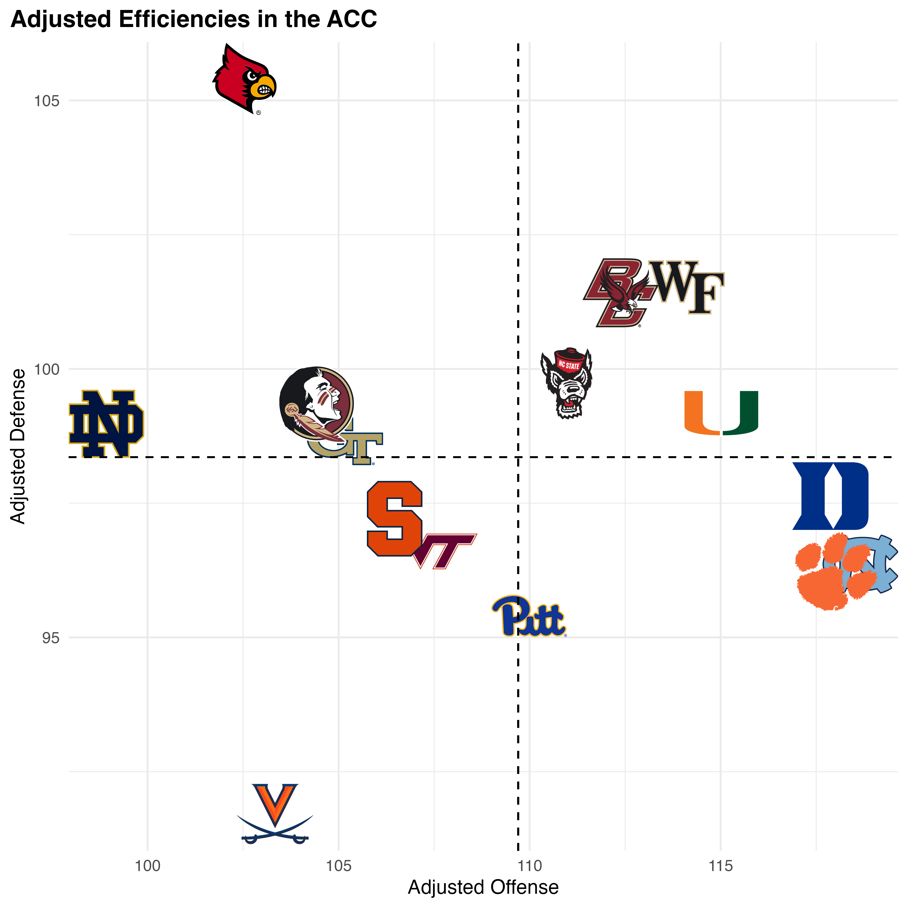
```

And with just a few functions, we have pulled our data, plotted team values, drawn conference-average lines, and added labels. It is this simplicity that makes `cbbplotR` an invaluable tool for data analysis in college basketball.

### Conference Logos

Using the same process as above, we can quickly create a scatter plot with conference logos! You can also specify `logo_type = "wordmark"` to plot conference wordmarks instead of logos.

```{r}
conf_data %>% 
  ggplot(aes(adj_o, adj_d, conference = conf)) +
  geom_cbb_conferences(width = 0.12) +
  geom_mean_lines(aes(x0 = adj_o, y0 = adj_d), color = 'black') +
  theme_minimal() +
  theme(plot.title.position = 'plot',
        plot.title = element_text(face = 'bold')) +
  labs(title = 'Adjusted Efficiencies Across Top 10 Conferences',
       x = 'Adjusted Offense',
       y = 'Adjusted Defense')
```

```{r, eval=TRUE, echo=FALSE}
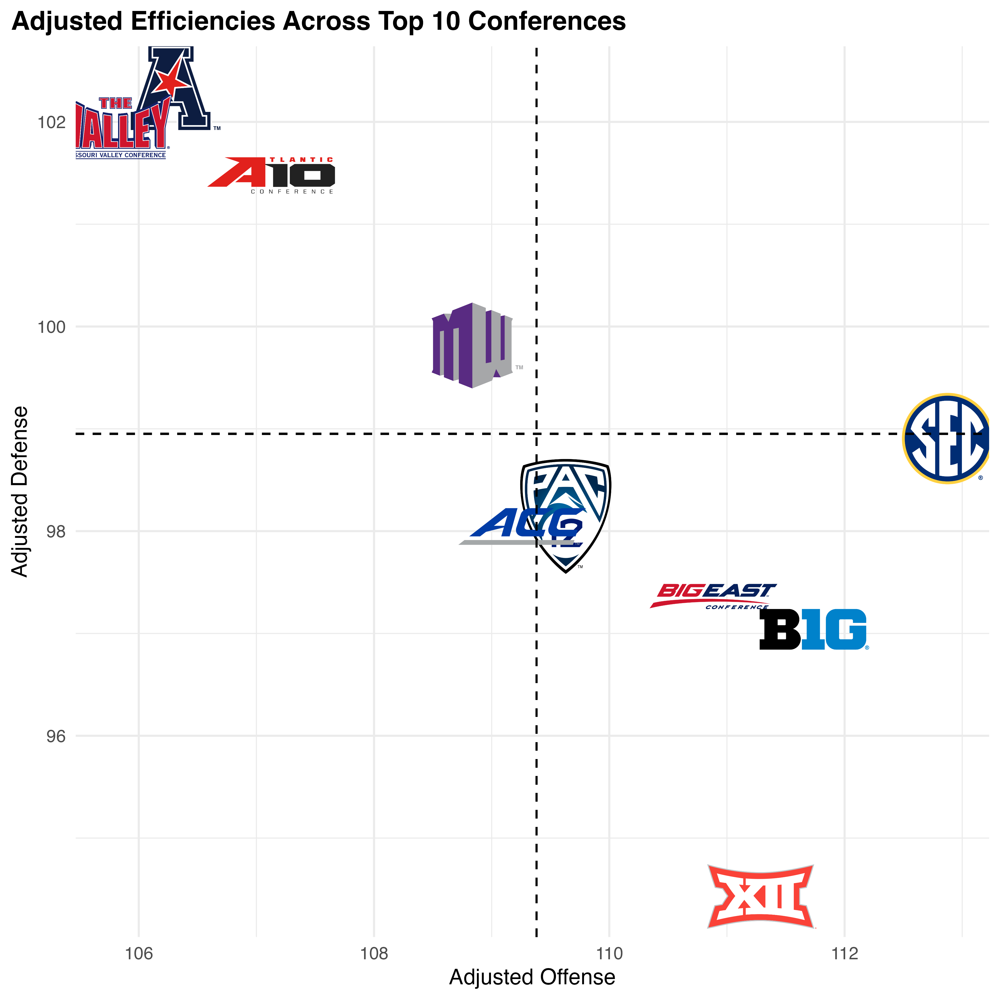
```

An important caveat: Conferences are weird. Many of the logos are different dimensions and might require fine-tuning inside your `aes` by adjusting the `size` parameter for certain ones. `cbbplotR` *does* automatically resize a few conferences, but it might not be sufficient for your needs.

### Player Headshots

With **`cbbplotR`**, you can also incorporate player headshots into your visualizations. While `cbbplotR` *does* provide a helper function to retrieve ESPN player IDs, `get_espn_players`, there is no guarantee that player names will match across any other data source – including `cbbdata`. There is no support for player name matching.

```{r}
set.seed(50)

player_ids <- get_espn_players('Duke')

random_data <- tibble(
  val1 = rnorm(nrow(player_ids)),
  val2 = rnorm(nrow(player_ids)),
  id = player_ids$id
)

random_data %>% 
  ggplot(aes(val1, val2)) +
  geom_cbb_headshots(aes(player_id = id, width = 0.1)) +
  theme_minimal() +
  theme(
    plot.title = element_text(face = 'bold', size = 14),
    plot.title.position = 'plot'
  ) +
  labs(title = 'Random data to show plotting headshots')
```

```{r, eval=TRUE, echo=FALSE}
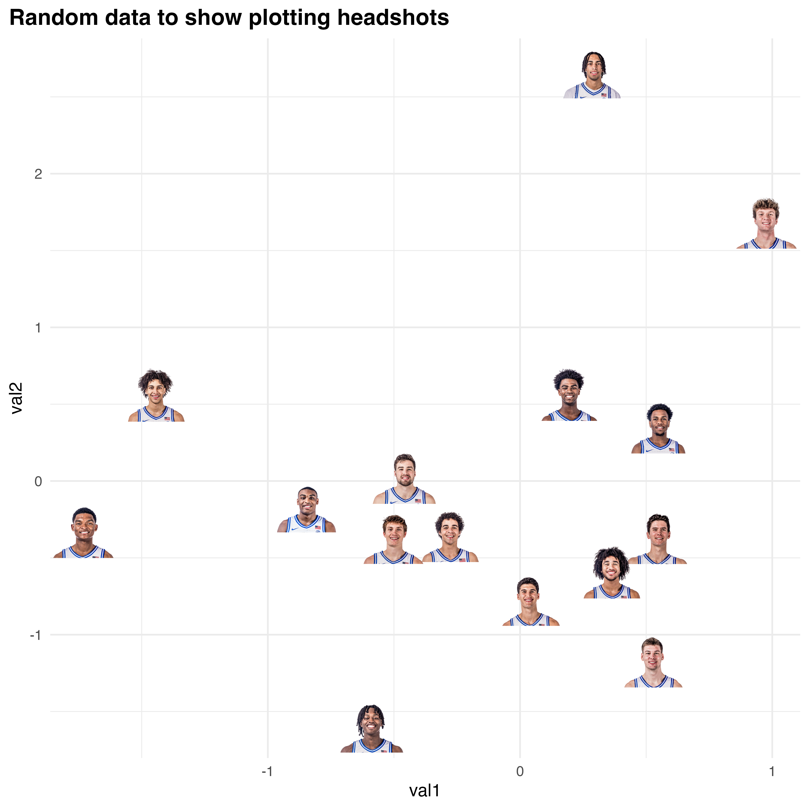
```

## But I have too many teams // want to focus on a select few!

There are *a lot* of Division 1 basketball teams, and drawing effective plots with hundreds of logos is challenging. One of the standout features of **`cbbplotR`** is its ability to highlight specific elements in your plots. This is particularly useful when dealing with a large number of logos or data points, but you want to draw attention to only a few key items. You can apply highlighting to teams, conferences, and players.

Highlighting in **`cbbplotR`** is designed to be both intuitive and flexible. You have several methods at your disposal:

1.  **Transparency Adjustment**: By setting a low alpha level for all elements except the ones you wish to highlight, you can subtly bring forward the focus points while keeping the context in the background.

2.  **Grayscale Application**: Another method involves converting all non-essential logos to grayscale, making the colored logos of your highlighted teams or conferences stand out vividly.

#### Implementation

Implementing these methods is straightforward. You can adjust your data manually, providing `alpha`and/or `color` values to certain teams, and pass those values to an `aes` layer – or you could let `cbbplotR` do the heavy lifting. Without needing to touch your own data, you can pass a vector of teams, conferences, or player IDs through the `highlight_X` argument of `geom_cbb_X` functions and specify a highlight type – `alpha`, `color`, or `both`.

For example, let’s assume that we want to highlight the four Tobacco Road teams but still show their position relative to the rest of the ACC.

```{r}
acc_team_data %>%
  ggplot(aes(adj_o, adj_d, team = team)) +
  geom_cbb_teams(highlight_teams = c('Duke', 'North Carolina', 'Wake Forest', 'North Carolina St.'), width = 0.08, highlight_method = 'both') +
  geom_mean_lines(aes(x0 = adj_o, y0 = adj_d), color = 'black') +
  theme_minimal() +
  theme(
    plot.title = element_text(face = 'bold', size = 14),
    plot.title.position = 'plot'
  ) +
  labs(title = 'Adjusted Efficiencies in the ACC (highlight: transparency)',
       x = 'Adjusted defense',
       y = 'Adjusted offense')
```

```{r, eval=TRUE, echo=FALSE}
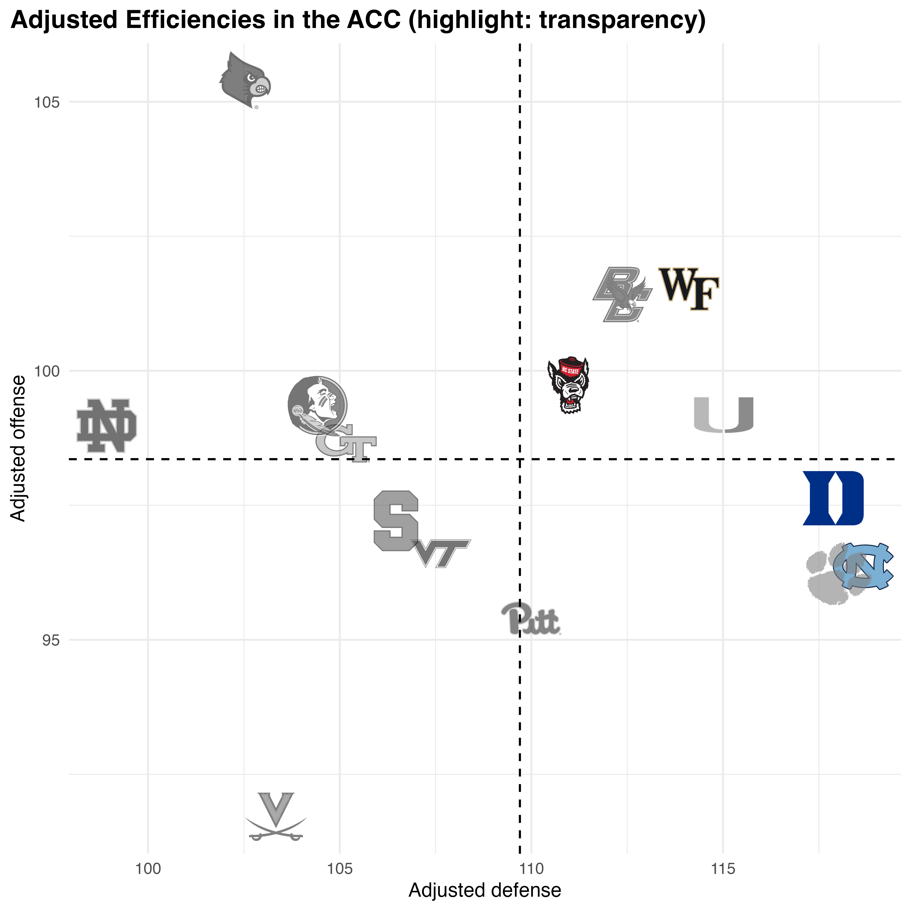
```

In this example, we chose to highlight our teams by increasing the transparency *and* changing logos to grayscale for our non-selected teams. You can choose to do both, `highlight_method = "both"`, or just one, `highlight_method = "alpha"` // `highlight_method = "color"`.

The process is analogous for the other `geom` methods – but the argument names switch relative to the function (`highlight_conferences` and `highlight_players`).

## Plotting **in element\_ Areas**

**`cbbplotR`** extends the standard capabilities of **`ggplot2`** by allowing you to place logos and headshots in various parts of your plot, such as in axes labels or inline with plot titles.

### **Logos in Axes**

With **`element_cbb_teams`**, `element_cbb_conferences`, and `element_cbb_headshots`, you can replace traditional axis text with logos and headshots. Like with the `geom_cbb_X` functions, the `element_cbb_X` functions are just as intuitive!

Now, let's plot adjusted offensive efficiency in the ACC while placing team names on the X-axis.

```{r}
acc_team_data %>%
  ggplot(aes(team, adj_o)) +
  geom_col() +
  theme_minimal() +
  theme(
    plot.title = element_text(face = 'bold', size = 14),
    plot.title.position = 'plot',
    axis.text.x = element_cbb_teams(size = 0.9)
  ) +
  labs(title = 'Adjusted Efficiencies in the ACC',
       y = 'Adjusted offense',
       x = NULL)
```

```{r, eval=TRUE, echo=FALSE}
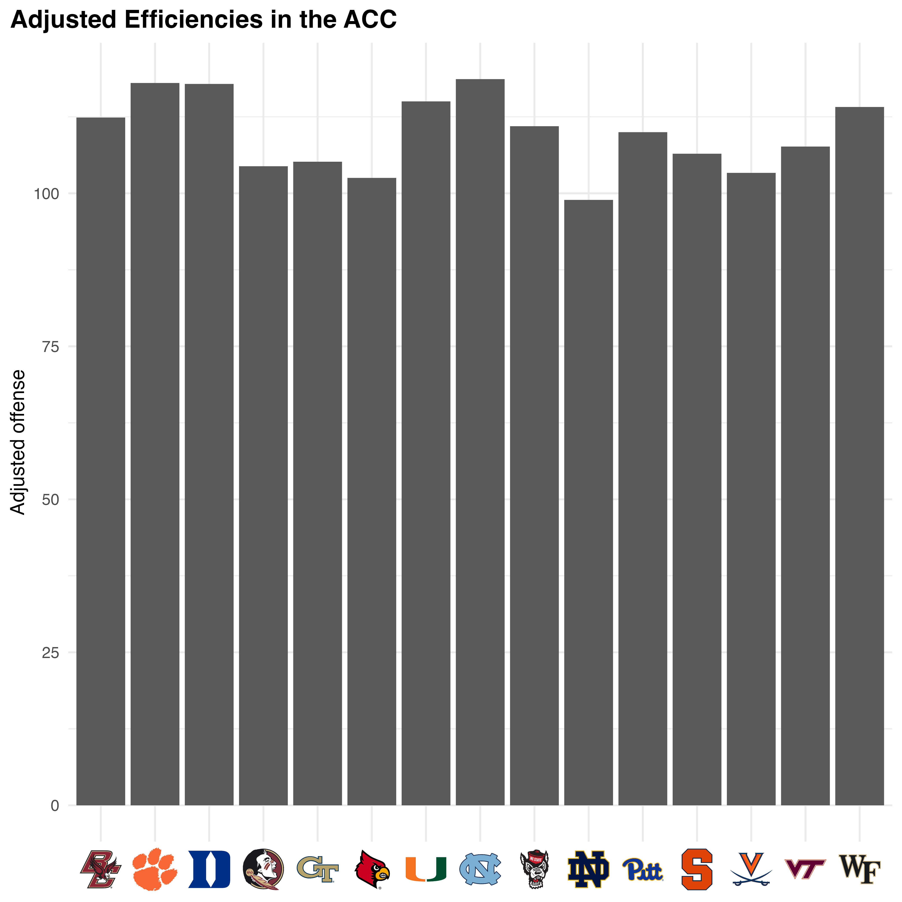
```

And just like that, we have team logos on our axis! We can similarly do the same with player headshots *and* conference logos. For conference logos, you can similarly plot logos or wordmarks by using the `logo_type` argument. Let's try one example using player headshots.

```{r}
set.seed(50)

player_ids <- get_espn_players('Duke')

random_data <- tibble(
  val1 = rnorm(nrow(player_ids)),
  val2 = rnorm(nrow(player_ids)),
  id = player_ids$id
)

random_data %>% 
  ggplot(aes(id, val2)) +
  geom_col() +
  theme_minimal() +
  theme(
    plot.title = element_text(face = 'bold', size = 14),
    plot.title.position = 'plot',
    axis.text.x = element_cbb_headshots(size = 0.8)
  ) +
  labs(title = 'Random data to show plotting headshots',
       x = NULL)
```

```{r, eval=TRUE, echo=FALSE}
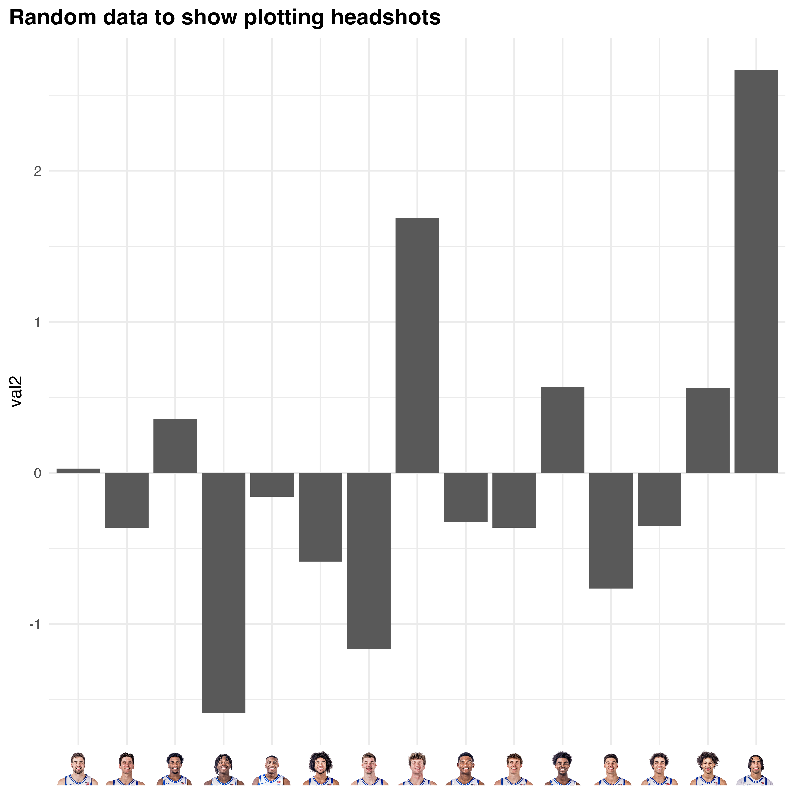
```

### **Logos in Facets**

The `element_cbb_X` functions also allow for plotting in facet titles. This is achieved by using an `element` function in conjunction with `strip.text.x` or `strip.text.y`.

```{r}
facet_data %>% 
  ggplot(aes(date, avg_rating)) +
  geom_line() +
  facet_wrap(~conf) +
  theme_minimal() +
  theme(
    plot.title = element_text(face = 'bold', size = 14),
    plot.title.position = 'plot',
    strip.text.x = element_cbb_conferences(size = 1)
  ) +
  labs(title = 'Average T-Rank Rating for Select Conferences in 2024',
       x = 'Date',
       y = 'T-Rank Rating')
```

```{r, eval=TRUE, echo=FALSE}
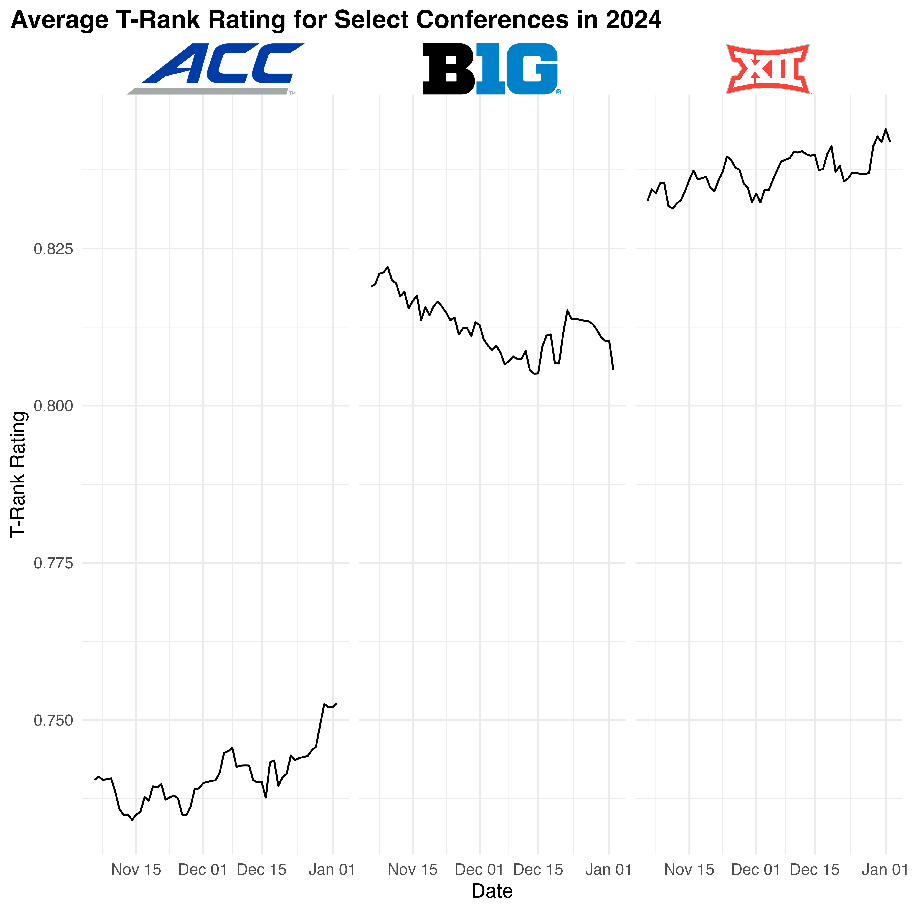
```

## **Colors and Fills**

**`cbbplotR`** provides powerful functionalities for incorporating team and conference colors into your **`ggplot2`** visualizations. By using the **`scale_color/fill_cbb_X`** functions, you can easily map the aesthetic properties of your plots to the official colors of college basketball teams and conferences.

To make these functions work, simply assign `color` and/or `fill` properties in `aes` to your team or conference columns, and then add the appropriate scale function.

### **Using Scale Functions**

The `scale_color_cbb_teams` and `scale_fill_cbb_teams`  unctions allow you to assign team-specific colors to various plot elements. The `scale_color_cbb_conferences` and `scale_fill_cbb_conferences` functions work in the same manner and allow you to assign conference-specific color values.

```{r}
acc_team_data %>%
  ggplot(aes(team, adj_o, fill = team)) +
  geom_col() +
  scale_fill_cbb_teams() +
  theme_minimal() +
  theme(
    plot.title = element_text(face = 'bold', size = 14),
    plot.title.position = 'plot',
    axis.text.x = element_cbb_teams(size = 0.8)
  ) +
  labs(title = 'Adjusted Efficiencies in the ACC',
       y = 'Adjusted offense',
       x = NULL)
```

```{r, eval=TRUE, echo=FALSE}
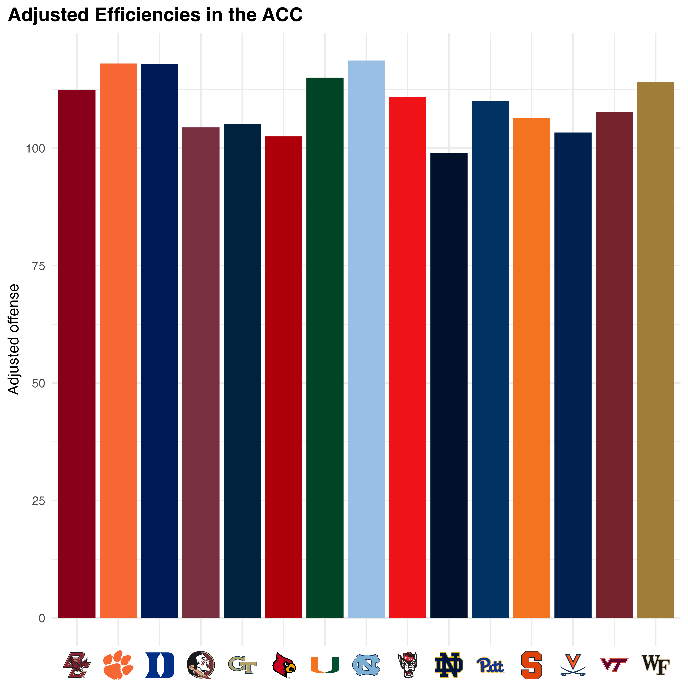
```

## My Plots pane is freezing in RStudio!

If you are plotting numerous team logos, you might notice that RStudio can be slow to return the plot itself – which can possibly lead to your R session aborting. To fix this, `cbbplotR` borrows a function from the `ggpath` package called `ggpreview` – which saves a temporary image of your plot and returns it in the *Viewer* pane. It is recommend to then expand that window in your browser.

To use `ggpreview`, you need to store your plot as a variable and then pass it to the `ggpreview` function. The function also takes arguments for plot dimensions.

For example, if we were to draw a plot showing every team’s adjusted efficiencies, that would require rendering 362 logos, which would definitely cause us some problems. But with `ggpreview`, we can store our plot as a variable and view a temporary image of it! This entire process takes fewer than 10 seconds.

```{r}
p <- cbbdata::cbd_torvik_ratings(year = 2024) %>%
  ggplot(aes(adj_d, adj_o, team = team)) +
  geom_mean_lines(aes(x0 = adj_d, y0 = adj_o), color = 'black') +
  geom_cbb_teams(width = 0.03) +
  theme_minimal() +
  theme(
    plot.title = element_text(face = 'bold', size = 14),
    plot.title.position = 'plot'
  ) +
  labs(title = 'Adjusted Team Efficiencies',
       x = 'Adjusted defense',
       y = 'Adjusted offense')

ggpreview(p)
```

## gt Utility Functions

`cbbplotR` ships with a number of utility functions for use in conjunction with the `gt` tables package. Notably, `cbbplotR` ports over the `cbd_gt_logos` and `gt_theme_athletic` functions from `cbbdata` – the former is now called `gt_cbb_teams` while both are formally deprecated from the `cbbdata` package for consistency.

### Plotting Logos and Wordmarks

As mentioned, the `gt_cbb_teams` and `gt_cbb_conferences` functions allow for seamless integration of team and conference logos in table columns. For practicality, only conference wordmarks are able to be plotted. If you wish to hide names from the table, you can set the `include_names` argument to `FALSE`.

```{r}
acc_team_data %>% 
  slice(1:5) %>% 
  select(team, barthag, barthag_rk, adj_o, adj_d) %>% 
  gt_cbb_teams(team, team) %>% 
  gt() %>% 
  fmt_markdown(team)
```

```{r, eval=TRUE, echo=FALSE}
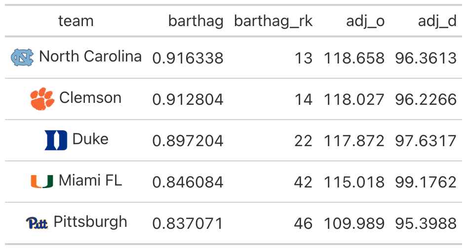
```

We can do the same thing with conference data too. By default, conference names are excluded from the table.

```{r}
conf_data %>% 
  slice(1:5) %>% 
  select(conf, barthag, adj_o, adj_d, adj_t) %>%
  gt_cbb_conferences(conf, conf) %>% 
  gt() %>% 
  fmt_markdown(conf)
```

```{r, eval=TRUE, echo=FALSE}
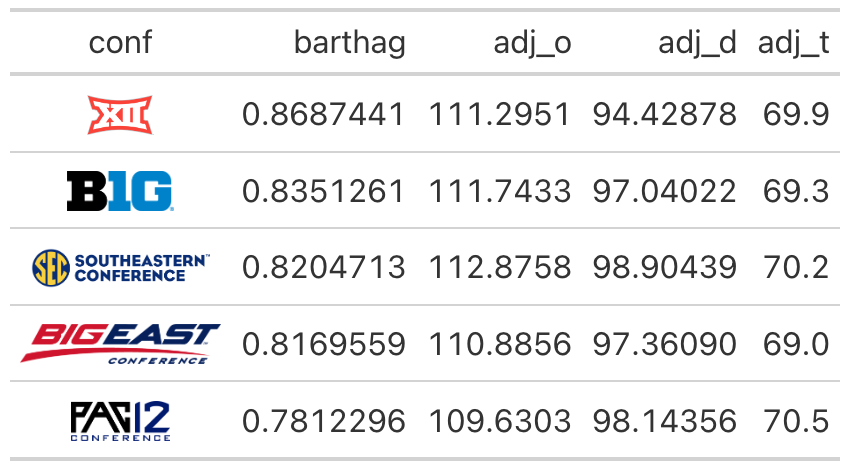
```

### Coloring Rows

`cbbplotR` includes two helper functions for filling cell bodies. If you have a win/loss column and wish to fill based on results, the `gt_color_results` function is a quick solution. You can pass through a traditional column with 'W' and 'L' values, or you can pass through boolean values and set the `result_type` argument to `binary`. By default, the function expects the results column to be named `result` but this can be changed by using the `result_column` argument.

```{r}
df <- data.frame(
  result = c(1, 0, 0, 0, 0, 1),
  val1 = runif(6)
)

df %>% 
  gt() %>% 
  gt_color_results(result_type = 'binary')
```

```{r, eval=TRUE, echo=FALSE}
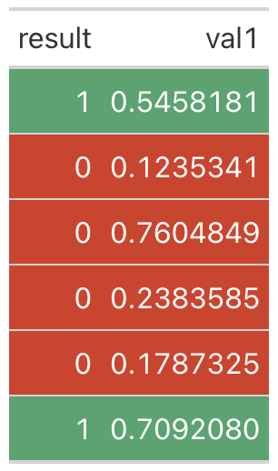
```

The other utility function is `gt_bold_rows`. This is a general catch-all term for a function that allows you to set the background color and font weight of particular rows. You can either pass through an empty function, or you can declare some statement that identifies which rows to alter.

I wrote this function because I often find myself only needing to bold or highlight *certain* rows where some condition is true. For example, let's bold and highlight *only* rows where `cyl == 4` in the `mtcars` data set.

```{r}
mtcars %>% 
  slice(1:10) %>% 
  gt() %>% 
  gt_bold_rows(filter_statement = "cyl == 4",
               highlight_color = 'darkblue',
               text_color = 'white')
```

```{r, eval=TRUE, echo=FALSE}
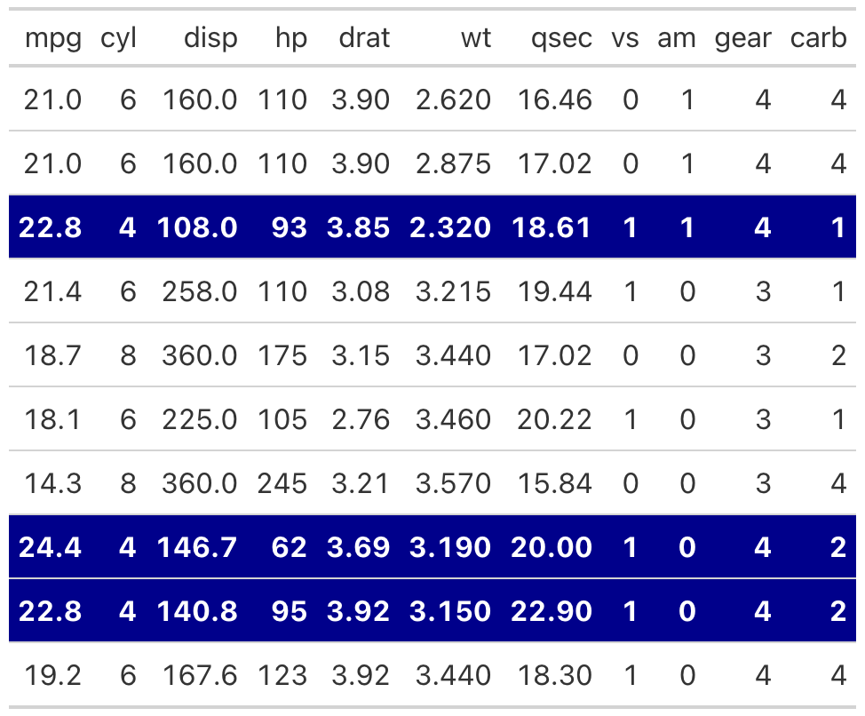
```

You can further extend this to compound filters. For example, let's do the same thing for rows where `cyl == 4` **and** `hp > 90`. This should highlight two rows.

```{r}
mtcars %>% 
  slice(1:10) %>% 
  gt() %>% 
  gt_bold_rows(filter_statement = "cyl == 4 & hp > 90",
               highlight_color = 'darkblue',
               text_color = 'white')
```

```{r, eval=TRUE, echo=FALSE}
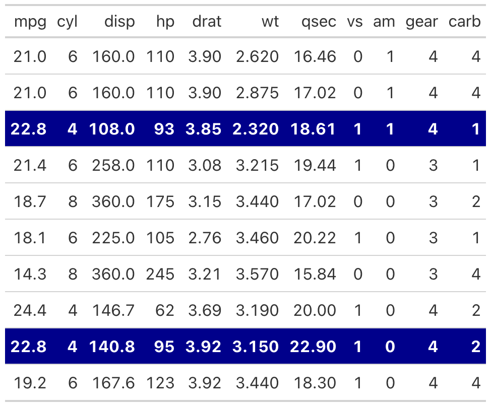
```

### Appearances

`cbbplotR` ships with three functions that alter the appearance of `gt` tables. The first is `gt_cbb_logo_title` – a function that neatly adds a conference logo, team logo, or player headshot in the heading space of your table.

To work with this function, you will need to declare an optional title and subtitle and the name of the item to plot. Alternatively, you can supply a custom link, through `logo_link`, that will plot that image. You can adjust various things about the title and subtitle itself, including the `logo_height`.

For example, let's plot the `mtcars` data set and add Duke's logo.

```{r}
title <- gt_cbb_logo_title(title = 'mtcars data',
                  subtitle = 'some random subtitle',
                  type = 'team',
                  value = 'Duke',
                  logo_height = 45)

mtcars %>% 
  slice(1:10) %>% 
  gt() %>% 
  tab_header(title = html(title))
```

```{r, eval=TRUE, echo=FALSE}
knitr::include_graphics('tab6.png')
```

Second, `gt_set_fonts` is a quick-and-easy solution to changing the font across all aspects of your `gt` table. This is inferior to the fine-tuning allowed by using `tab_style` functions but is nice to have for quick tables. By default, the function will attempt to load the font through Google Fonts. If you would rather have the font loaded through your system, set `from_google_font` to `FALSE`.

```{r}
mtcars %>% 
  slice(1:10) %>% 
  gt() %>% 
  gt_set_font('Oswald') %>% 
  tab_header(title = 'mtcars')
```

```{r, eval=TRUE, echo=FALSE}
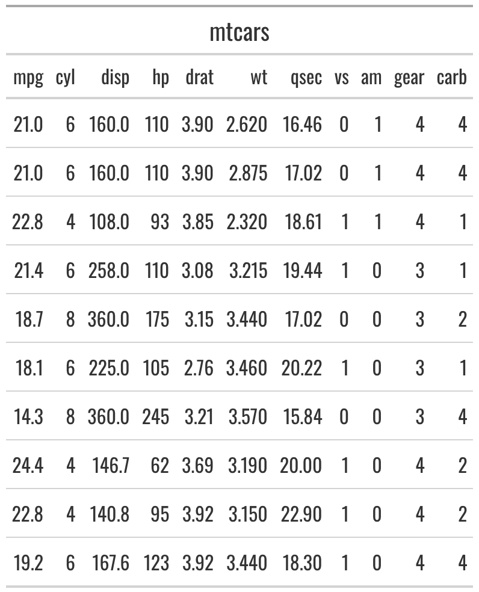
```

Lastly, `cbbplotR` includes a nice `gt` tables theme that is perfect for box scores or mono-spaced themes. It is inspired from *The Athletic* publication.

```{r}
mtcars %>% 
  slice(1:10) %>% 
  gt() %>% 
  gt_theme_athletic() %>% 
  tab_header(title = 'mtcars')
```

```{r, eval=TRUE, echo=FALSE}
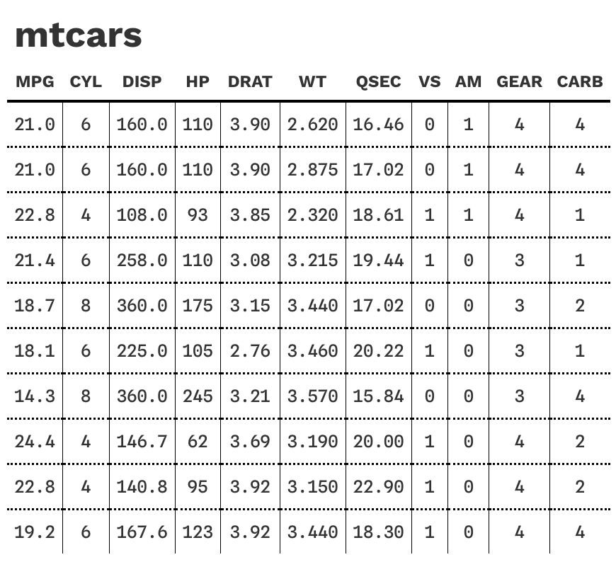
```

## Support

If you have feature recommendations or run into bugs, [please open an issue on GitHub](https://github.com/andreweatherman/cbbplotR). You can also [contact me directly on Twitter](https://twitter.com/andreweatherman), but I would prefer the latter.

If you are looking for more college basketball R packages, [check out `cbbdata`](https://cbbdata.aweatherman.com) – also developed and maintained by me.
